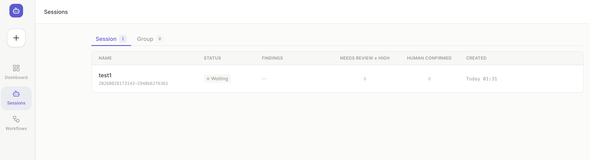

# open-drift

**Workflow-driven, multi-agent security audits for smart-contract projects.** Run staged audits locally, inspect evidence in one workspace, and turn agent output into reviewable findings.



## What it does

- Create audit tasks from a local project path or a single-project ZIP archive.
- Choose a workflow and assign an available agent to each stage.
- Trace entrypoints and data flows, investigate issues, then validate false positives and calibrate severity.
- Review findings, workflow progress, logs, and artifacts; export human-confirmed findings as Markdown.

Available agent integrations include Codex, the Claude Code harness with GLM or DeepSeek-compatible endpoints, and Gemini. The project includes 24 bundled audit skills, a web dashboard, and a REST API.

## Getting started

Requires Node.js 22+ and pnpm 11.7.0.

```bash
git clone https://github.com/ZerodriftSec/open-drift.git
cd open-drift
pnpm install --frozen-lockfile
cp .env.example .env
pnpm dev
```

Open [http://localhost:7001](http://localhost:7001), then configure at least one agent provider in `.env`. Create a task from a local project or ZIP, choose a workflow, assign an agent to each stage, and start the audit.

To run the bundled example audit, use:

```bash
pnpm run mock
```

This queues the `mock` Solidity project with the `simple` workflow and prints its Session URL. It requires a locally authenticated Codex runtime.

## License

Apache-2.0 licensed.
